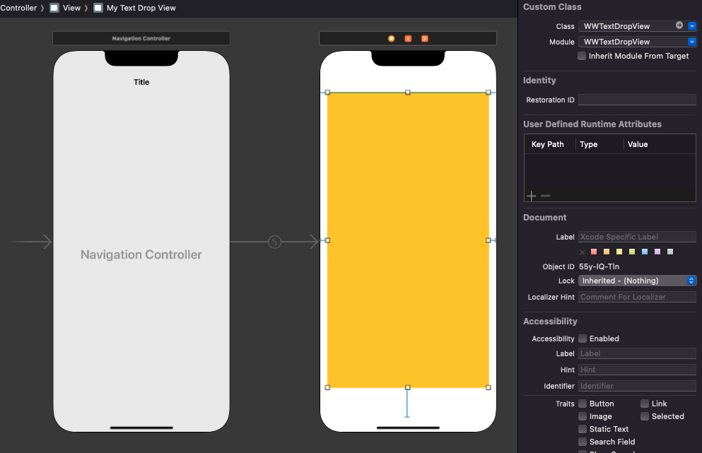
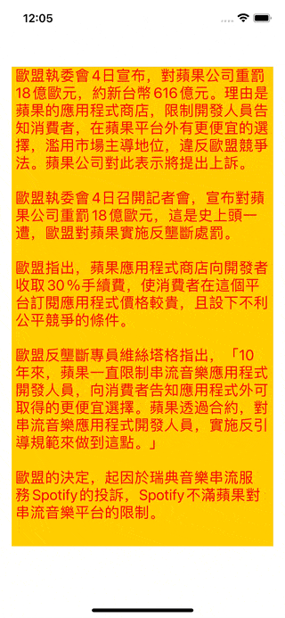

# WWTextDropView

[](https://developer.apple.com/swift/) [](https://developer.apple.com/swift/)  [](https://developer.apple.com/swift/) [](https://developer.apple.com/swift/)

## [Introduction - 簡介](https://swiftpackageindex.com/William-Weng)
- [A View with text falling animation.](https://www.twblogs.net/a/5ed27ce7c01f4b18418c8754)
- [一個有文字掉落動畫的View。](https://juejin.cn/post/6844903621553831944)





### [Installation with Swift Package Manager](https://medium.com/彼得潘的-swift-ios-app-開發問題解答集/使用-spm-安裝第三方套件-xcode-11-新功能-2c4ffcf85b4b)
```bash
dependencies: [
    .package(url: "https://github.com/William-Weng/WWTextDropView.git", .upToNextMajor(from: "1.0.0"))
]
```

### [Function - 可用函式](https://zh.wikipedia.org/zh-tw/验证码)
|函式|功能|
|-|-|
|configure(delegate:attributes:)|設定初始值|
|textDropEffect(duration:from:)|文字掉落效果|
|textRotateEffect(duration:radian:)|文字旋轉效果|

### Example
```swift
import UIKit
import WWPrint
import WWTextDropView

// MARK: - ViewController
final class ViewController: UIViewController {

    @IBOutlet weak var myTextDropView: WWTextDropView!
    
    override func viewDidLoad() {
        super.viewDidLoad()
        initSetting()
    }
    
    override func touchesBegan(_ touches: Set<UITouch>, with event: UIEvent?) {
        myTextDropView.textDropEffect(duration: 0.05, from: -32)
        myTextDropView.textRotateEffect(duration: 10)
    }
}

// MARK: - WWTextDropViewDelegate
extension ViewController: WWTextDropViewDelegate {
    
    func textRange(_ view: WWTextDropView, currentRange: Int, maxRange: Int) {
        wwPrint("文字字數 - \(currentRange) / 最多容納 - \(maxRange)")
    }
}

// MARK: - 小工具
extension ViewController {
    
    func initSetting() {
        
        let attributes: [NSAttributedString.Key : Any] = [
            .font: UIFont.systemFont(ofSize: 20),
            .foregroundColor: UIColor.red
        ]
        
        myTextDropView.configure(delegate: self, attributes: attributes)
        
        myTextDropView.text = """
        歐盟執委會4日宣布，對蘋果公司重罰18億歐元，約新台幣616億元。理由是蘋果的應用程式商店，限制開發人員告知消費者，在蘋果平台外有更便宜的選擇，濫用市場主導地位，違反歐盟競爭法。蘋果公司對此表示將提出上訴。
        
        歐盟執委會4日召開記者會，宣布對蘋果公司重罰18億歐元，這是史上頭一遭，歐盟對蘋果實施反壟斷處罰。

        歐盟指出，蘋果應用程式商店向開發者收取30％手續費，使消費者在這個平台訂閱應用程式價格較貴，且設下不利公平競爭的條件。

        歐盟反壟斷專員維絲塔格指出，「10年來，蘋果一直限制串流音樂應用程式開發人員，向消費者告知應用程式外可取得的更便宜選擇。蘋果透過合約，對串流音樂應用程式開發人員，實施反引導規範來做到這點。」

        歐盟的決定，起因於瑞典音樂串流服務Spotify的投訴，Spotify不滿蘋果對串流音樂平台的限制。
        """
    }
}
```
